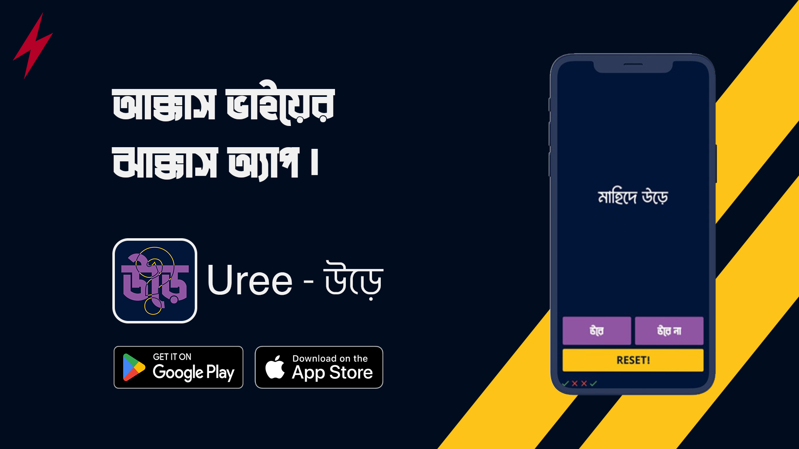

#

<h3>uree-উড়ে</h3>

<!-- 

## [Download Here!](https://github.com/0xMahid/uree_app/releases)

 -->

<h2>
<a href="https://github.com/0xMahid/uree_app/releases">
Download Here
</a></h2>

## Projects inside look.

This project is a starting point for a Flutter application.

A few resources to get you started if this is your first Flutter project:

- [Lab: Write your first Flutter app](https://docs.flutter.dev/get-started/codelab)
- [Cookbook: Useful Flutter samples](https://docs.flutter.dev/cookbook)

For help getting started with Flutter development, view the
[online documentation](https://docs.flutter.dev/), which offers tutorials,
samples, guidance on mobile development, and a full API reference.
